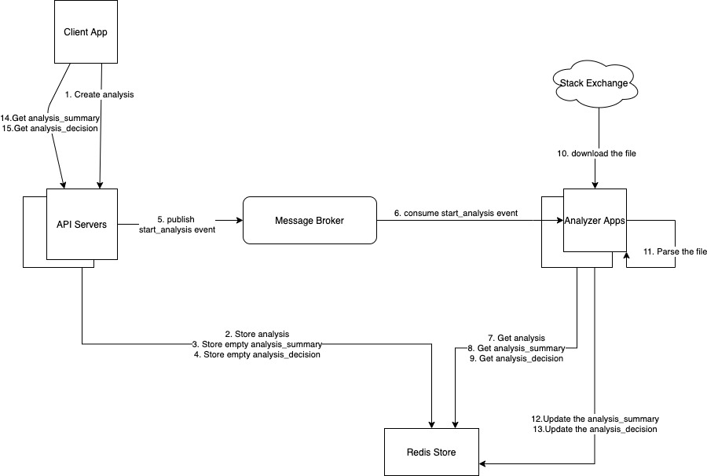

# Stack Exchange Content Analyzer

This project uses Quarkus framework.

## Design 


## Running the application in dev mode

Please run Redis cache store initially in the first terminal
```shell script
docker run --ulimit memlock=-1:-1 -it --rm=true --memory-swappiness=0 --name redis_quarkus_test -p 6379:6379 redis:5.0.6
```

Please run the api application in the second terminal
```shell script
cd content-analysis-api
./mvnw compile quarkus:dev
```

Please run the analyzer application in the third terminal
```shell script
cd content-analyzer
./mvnw compile quarkus:dev
```

## Sample REST Calls
Swagger UI link http://localhost:8080/q/swagger-ui/

### Curl command to create the analysis
```
curl -X 'POST' \
'http://localhost:8080/analyzer/V1/analyses' \
-H 'accept: */*' \
-H 'Content-Type: application/json' \
-d '{
"url": "https://raw.githubusercontent.com/wizzaw/stack-exchange-content-analyzer/main/example-data/3dprinting-posts.xml"
}'
```

#### Expected output
```
{
  "id": "<a UUID>"
}
```

### Curl command to delete the analysis
```
curl -X 'DELETE' \
'http://localhost:8080/analyzer/V1/analyses/uuid of the analysis>' \
-H 'accept: */*'
```
### Curl command to get the analysis summary
```
curl -X 'GET' \
'http://localhost:8080/analyzer/V1/analyses/8d986b37-4008-438d-a731-cbfb12a29907/summary' \
-H 'accept: */*'
```

### Expected output
```
{
"id": "98df872c-2f06-4c45-8073-d00b3eba7d0d",
"state": "FINISHED",
"analyzeDate": "2021-09-03T09:40:49.895117",
"failedSummary": "",
"duration": 35,
"firstPostDate": "2016-01-12T19:24:29.457",
"lastPostDate": "2021-02-21T09:29:40.710",
"totalPostCount": 303,
"totalAcceptedPostCount": 65,
"averageScore": 2
}
```

### Curl command to get the analysis details
```
curl -X 'GET' \
'http://localhost:8080/analyzer/V1/analyses/8d986b37-4008-438d-a731-cbfb12a29907/detail' \
-H 'accept: */*'
```

### Expected output
```
{
"id": "70461720-57cb-4b94-a95d-63dcfd677918",
"state": "FINISHED",
"failedSummary": "",
"posts": {
"1": {
"id": "1",
"score": 21,
"body": "<p>I have been wanting to learn about 3D printing a long time so I really want this site to succeed but I have no previous experience with the subject. </p>\n\n<p>I was wondering how can I help the site at this early stage. I thought about asking about how to get started with 3D printing but SE explicitly discourages \"easy\" questions in the private beta.</p>\n\n<p>What can newbies like me do for the site at this stage besides voting questions and answers?</p>\n",
"childBodies": [
"<p>I would suggest doing a bit of basic research on 3D printing (including reading questions and answers).  From these you will learn more about it and hopefull you will have new questions about 3D printing that can be asked.  </p>\n\n<p>If you are looking at getting a 3D printer, you could ask about different features listed and why they make prints better.</p>\n",
"<p>That's the goal of the site, learn, research and ask.</p>\n\n<p>While you learn, you can always perform other tasks such as:</p>\n\n<ul>\n<li>improve quality posts by proposing edits,</li>\n<li>be active in meta (propose new ideas or write your opinion which are always welcomed),</li>\n<li>review <a href=\"https://3dprinting.stackexchange.com/review\">moderation queues</a>,</li>\n<li>housekeeping - help to keep things organised (e.g. tags),</li>\n<li>propose descriptions for wiki tags,</li>\n<li>vote on questions, down-vote bad or propose changes on low-quality posts,</li>\n<li>and so on.</li>\n</ul>\n",
"<h1>Vote!</h1>\n\n<p>Private Betas love, love, <em>love</em> votes. Without votes, it's difficult to attain privileges, get rewards, and help push us out to public beta.</p>\n\n<h1>Ask Questions!</h1>\n\n<p>I know you said this:</p>\n\n<blockquote>\n  <p>I thought about asking about how to get started with 3D printing but SE explicitly discourages \"easy\" questions in the private beta.</p>\n</blockquote>\n\n<p>But here's the catch. \"Easy\" isn't defined. If you have an \"easy\" question, but it is specific, high-quality, and to the point, and you can show some effort in it, then, please, go ahead and ask it!</p>\n\n<h1>Participate!</h1>\n\n<p>You have a voice in our meta discussions as well. You also have the authority to suggest edits, to posts, tag wikis, and tag excerpts. They also get you +2 rep for each that is approved, which can help bring you more afloat. You can also give your opinion in scope, by casting close and reopen votes as well :)</p>\n"
]
},
"2": {
"id": "2",
"score": 2,
"body": "<p>There are many different printing technologies. While it might be clear to the asker that he's talking about his home 3D printing machine, that's not necessarily the case for those that try to answer the question.</p>\n\n<p>I think it would help to specify the scope of questions with tags, to allow future visitors to identify what type of 3D printer it is about. Answers to a lot of questions related to general properties of the printing process like printing speed, resolution, additional manual work, support structures, etc. depend heavily on the technology that's being used.</p>\n\n<p>This also prevents \"Well, it depends...\" type of answers that cover a lot of possibly unrelated things.</p>\n",
"childBodies": [
"<p>No, there will be many questions which are more general in nature, and have little to do with the actual process used to produce the part.</p>\n\n<p>We should encourage tag use for process when appropriate, but I don't think making it mandatory will work in the long term.</p>\n",
"<p>For questions where the technology matters, absolutely.</p>\n\n<p>If you look at Stack Overflow, for example, all questions must be tagged with the language the OP is asking about. I doubt there will be many questions that are asking about all technologies at once - and if they are, that's likely to be marked as too broad anyway.</p>\n",
"<p><em>Mandatory</em> is a probably poor choice of words. Not every question is going to be about the use of specific equipment. </p>\n\n<p>As with <em>any</em> Q&amp;A site, a user should always include enough background and support information in the body of the question so it can be answered <em>definitively.</em> If the specific material or equipment is relevant, be sure to include that information in the post.</p>\n\n<p>But if that information is missing, readers can use the 'comments' section to ask the author to go back and clarify the original post. Comments are meant to ask for clarification or to include other information that can somehow improve the original post (questions and answers). Keep at it; editing and constantly improving a post is what this is all about. These posts should serve as a model to the industry and serve as a source authority. But <strong>please do not use comment to answer questions</strong>. Comments are not well-equipped to properly vet any content. Thanks.</p>\n"
]
} ...
```
